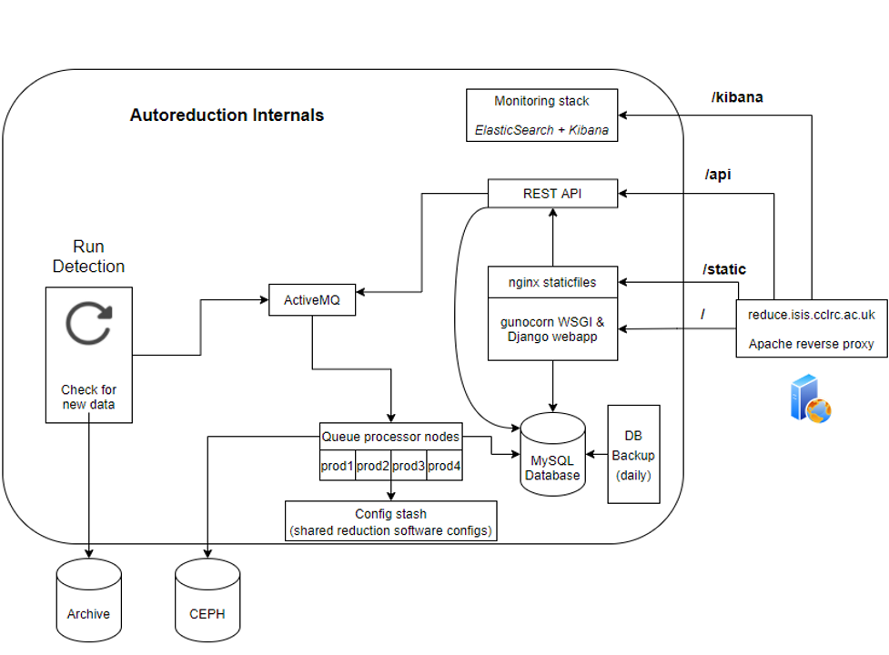
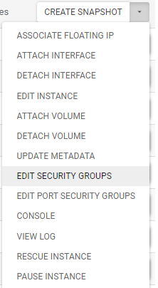

# Autoreduction design document
## Overview
### Chart

### Description
The Autoreduction project provides and maintains an online service for automatic
data reduction and processing during data gathering for experiments from all ISIS instruments

### URLs
Autoreduction website - https://reduce.isis.cclrc.ac.uk/
Kibana - https://reduce.isis.cclrc.ac.uk/kibana
ActiveMQ Dashboard - https://reduce.isis.cclrc.ac.uk/amq
Openstack URL - https://openstack.stfc.ac.uk/project/instances/
Jira - https://autoreduce.atlassian.net/
Github org - https://github.com/autoreduction

## Parts

This section will go over each individual part of the Autoreduction service.

Deployment commands are captured in the [Makefile](https://github.com/autoreduction/ansible/blob/main/Makefile)
of the `ansible` repository, allowing deploying or restarting with `make deploy-<service>` or `make restart-<service>`.

Before being able to run any playbooks you'll have to store the
[production vault key](https://keepersecurity.eu/vault/#detail/DwX7J15B4aF0tp85ggE4nQ) in `ansible/vault-key.prod`.

Note that playbooks for autoreduce-frontend, queue-processor (autoreduce-qp), rest-api and run-detection
are in their own repositories, combined with the container definition files.

### Production packages & containers
All packages are built in their respective repository with either `make` or `make package`. For uploading
check the [pypi docs](https://packaging.python.org/en/latest/tutorials/packaging-projects/#uploading-the-distribution-archives).

All PRs also attempt to upload a package to pip, and should be successful if the version in the `setup.py` is incremented.

All production containers are built in the [autoreduce-containers](https://github.com/autoreduction/autoreduce-containers) repository.

To upload to the Github Container repository (GHCR) follow instructions on the [docs](https://github.com/features/packages).

### Apache reverse proxy at `reduce.isis.cclrc.ac.uk`
The only part of the service left on Windows. It only hosts the Apache2.4 reverse proxy, but also contains the certs for HTTPS
Configuration file location `C:\Apache24\conf\httpd.conf`. To restart after changing: Open Services, right click Apache24 and restart.

This also handles the HTTPS certificates, the config for which is contained in the same `httpd.conf`. Kibana
tracks when the expiry date of the certs is.

#### **Current deployment**:
It handles all incoming requests to reduce.isis.cclrc.ac.uk, and forwards these URLs specifically:
- `/` to `webapp-prod` at port 8000
- `/static` to the `nginx` staticfiles server in `webapp-prod` at port 80
- `/kibana` to the Kibana server
- `/amq` to the admin dashboard of ActiveMQ

### Webapp & staticfiles
The webapp instance is hosted on `webapp-prod` `172.16.113.48`

The webapp instance hosts both the `webapp` and the static files server.

#### **Responsibility**:
The webapp is the main interface that users interact with. It's responsible for showing results
from reductions, and allowing users some control over variable values and starting re-runs.

#### **Current deployment**:
The `webapp` is hosted via the Docker container, which runs the django app by using gunicorn as WSGI.
The static files is a simple nginx server. On start, the webapp will run `manage.py collectstatic` and
all the static files will be copied in the `/staticfiles` directory, from where they are served by Django.
Having a static files server was necessary to dynamically add plot figures & images, as using the Django
server itself is not recommended, and the alternative [WhiteNoise](http://whitenoise.evans.io/)
does not dynamically reload available files.

Make sure that ports 80 (served by nginx for staticfiles) and 8000 (served by gunicorn for the django app) are
OPEN in the security groups on Openstack:

#### **New deployment**:
This service can be deployed entirely via the playbook
[deploy](https://github.com/autoreduction/ansible/blob/1958385988a3b8c805db6f82cf50e133ce981aac/playbooks/webapp/deploy.yml),
however the **Security groups** must be manually configured via the openstack interface.

### REST API
The REST API instance is hosted on `rest-api`. This has no additional parts apart from the main package.

#### **Responsibility**:
The REST API is responsible for handling all job submissions, both from run-detection and re-runs from the webapp.

It processes the requests and submits the message to ActiveMQ.

#### **Current & new deployments**:
Deployments use the `rest-api/deploy.yml` playbook. Security groups must be added for port 8000.

### Queue Processors
The queue processors are the ActiveMQ consumers and are scalable. They are identified by `qp-prod` and a number as suffix.

#### **Responsibility**:
The queue processors consume ActiveMQ messages containing information about the reductions,
and proceed to execute the reductions.

#### **Current & new deployments**:
Deployment uses the `queue-processors/deploy.yml` playbook. The playbook will fully
configure a node from scratch, to connected to ActiveMQ and ready to process runs.

### Database
The production database uses MySQL. It is ran via a docker container with a volume bind to `/var/lib/mysql` to ensure data persistence

#### **Current & new deployments**:
Deployment uses the `database/deploy.yml` playbook. The playbook will fully configure the DB and get it ready for connections

### Database backup
The database backup runs daily backup on the full production database, and restores it in a local SQLite3 database,
to ensure that the backups are actually working.

#### **Current & new deployments**:
Deployment uses the `database/backup.yml` playbook and will configure the node to do the daily backup & restore.

### ActiveMQ
This is the messaging queue for the service. All runs are submitted to it,
and are picked up by the queue processor consumers for processing

#### **Current & new deployments**:
Deployment uses the `activemq/deploy.yml` playbook. There's some additional configuration handled for this deployment:
- Password for consumers is configured in `activemq.xml`
- Admin dashboard passowrd is configured in `jetty-realm.properties`

### Run detection
This monitors what runs are the latest one on the ISIS archive. It checks a lastruns.txt in each instrument folder,
and if the number is newer it submits the difference in runs. The rest-api will then take care of finding the
data location and submit the run to ActiveMQ,

#### **Current & new deployments**:
Deployment uses `run-detection/deploy.yml`.

### Monitoring ELK
TLDR: Accessible at: https://reduce.isis.cclrc.ac.uk/kibana. Current machine `172.16.101.100` with 1.5TB volume attached for indexing data storage.

The monitoring stack consists of:
- Elasticsearch for gathering and indexing data & logs
- Kibana for displaying it
- Logstash is not used at this point, and the logs are not explicitly filtered, apart from what can be done in Kibana.
- Every production machine in [Ansible's hosts.yaml monitoring](https://github.com/autoreduction/ansible/blob/main/hosts.yaml#L97-L107) gets 2 beats installed:
    - metricbeat - reporting machine stats: cpu, memory, disk space, network usage
    - filebeat - reporting logs, reading from a file or docker logs
    - On some machines extra plugins are activated, such as the ActiveMQ and Apache plugins in metricbeat

#### **Current deployment**:
- The Elasticsearch and Kibana services are currently are deployed on the same instance and run together, the [monitoring-host](https://github.com/autoreduction/ansible/blob/main/hosts.yaml#L95-L97)
    - There is an external volume attached to the instance with size 1.5TB
- `filebeat` and `metricbeat` are installed on all nodes in [monitoring](https://github.com/autoreduction/ansible/blob/main/hosts.yaml#L98-L109)
- The `elasticsearch` security groups is added, which opens ports 9200 (for elasticsearch) and 5161 (for kibana)

#### **New deployment**:
- New deployment is a bit more involved as some steps are explicitly prevented from being scripted, though automation might be possible by using `https://github.com/elastic/ansible-elasticsearch`
- Run `make deploy-monitoring-host` to install `elasticsearch` & `kibana` services.
- If a new host is used then certificates need to be regenerated:
    - SSH onto the new host after installing elasticsearch
    - Run `/usr/share/elasticsearch/bin/elasticsearch-certutil http` and use following config. Note: these require [y/n] inputs. no = select `n`
        - no CSR
        - no existing CA
        - no CA password
        - 5y valid
        - no certificate per node
        - hostnames:
            - reduce.isis.cclrc.ac.uk
        - ip addresses:
            - 172.16.101.100 (current IP of `elasticsearch-1`, this will change when a new instance is used)
        - password for `http.p12` file: open `ansible-vault edit --vault-password-file vault-key.prod group_vars/all/vault.yml` and look for `vault_es_certs_password` key, copy the value and paste it in the `http.p12` password input. This step can't be omitted.
        - copy the output file `elasticsearch-ssl-http.zip` to the machine that will be doing the deployment via ansible, by default it will be something like this:
            - `scp /usr/share/elasticsearch/elasticsearch-ssl-http.zip <local machine>:~`
    - `/usr/share/elasticsearch/bin/elasticsearch-certutil ca` and save to `/elastic-stack-ca.p12`
    - `unzip elasticsearch-ssl-http.zip`
    - extract pem certificate from the CA with `openssl pkcs12 -in ca/ca.p12 -out elasticsearch-ca.pem -nokeys`
    - replace `roles/software/elastic/beats/install-ca/files/elasticsearch-ca.pem.vault` with the new file:
        - `mv elasticsearch-ca.pem roles/software/elastic/beats/install-ca/files/elasticsearch-ca.pem.vault`
    - encrypt `elasticsearch-ca.pem` the production vault password:
        - `ansible-vault encrypt roles/software/elastic/beats/install-ca/files/elasticsearch-ca.pem.vault`
    - Replace the `http.p12` file:
        - `mv elasticsearch/http.p12 roles/software/elastic/elasticsearch/files/http.p12`
    - encrypt it with the production vault password:
        - `ansible-vault encrypt  roles/software/elastic/elasticsearch/files/http.p12`
    - deploy the certificate changes with `make deploy-monitoring-host`
    - helpful debugging commands
        - just go into root user with `sudo su` to make seeing things easier
        - Elasticsearch
            - check service status: `service elasticsearch status`
            - service logs: `journalctl -u elasticsearch`
            - elasticsearch's own logs (not the same as the service) `less /var/log/elasticsearch/elasticsearch.log`
        - Kibana:
            - same as `elasticsearch` but replace all with `kibana`
        - The errors tend to be helpful. Sometimes requires reading a bit of the Java stack trace
- Set the password for the `elastic` superuser. This can only be done once the certificates are OK, as `elasticsearch-setup-passwords` contacts the elasticsearch API on port 9200, so if that isn't working properly, it can't be used
    - `/usr/share/elasticsearch/bin/elasticsearch-setup-passwords interactive`
    - Set the password to https://keepersecurity.eu/vault/#detail/2HU_AvSvG8Pn7_Qso8hmSw
