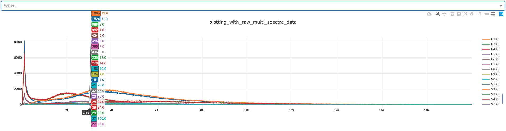

# Example Data Format

This document describes the desired format to prepare data for visualisation with Plotly Dash

### Running plotting_multi_spectra_data.py

Please note that plotting_multi_spectra_data.py will take some time to run due to the size 
of the multi spectra data file that needs to be reshaped.

For quicker execution times, a csv file is generated when run for hte first time with the new 
modified data format which can be used instead by following the below steps:  
* Inside plotting_multi_spectra_data.py:
    * Comment out line 79
    * Un-comment line 80
    * Comment out line 124
    * un-comment line 125
    
(The script will need to have been executed once before you make these changes for the script to 
read from the newly generated csv file.)

Only when you receive an output in your terminal similar to below is the visualisation ready.

```
Running on http://127.0.0.1:8050/
Debugger PIN: 880-009-103
 * Serving Flask app "plotting_with_raw_multi_spectra_data" (lazy loading)
 * Environment: production
   WARNING: This is a development server. Do not use it in a production deployment.
   Use a production WSGI server instead.
 * Debug mode: on
Running on http://127.0.0.1:8050/
Debugger PIN: 477-245-086
```

## Desired Plotting format for line and scatter visualisations

The preferred format for preparing data ready for visualisation is to store data to plot inside a 
pandas dataframe following the below format:
```
|Spectrum | X      | Y   | E  |
| :---    | :---: |:---:| ---:|
| 1       |       |     |     |
| 1       | 1.0   | 2.0 | 3.0 |
| 1       | 4.0   | 5.0 | 6.0 |
| 2       | 1.0   | 2.0 | 3.0 |
| 2       | 4.0   | 5.0 | 6.0 |
```

The minimum columns required are Spectrum, X and Y. additional columns can be added if required. 
the Spectrum column should act as the to allow for easy association and separation of data. 

The visualisation generated by plotting_multi_spectra_data.py will look similar to that seen below:


